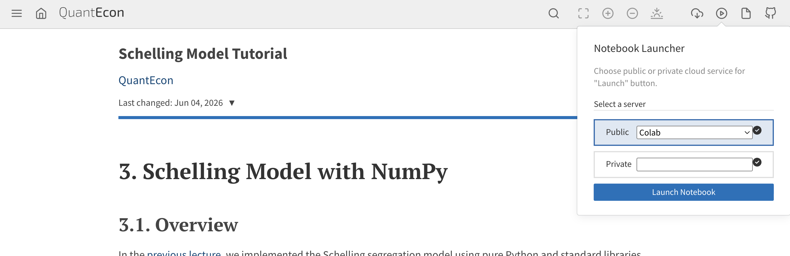
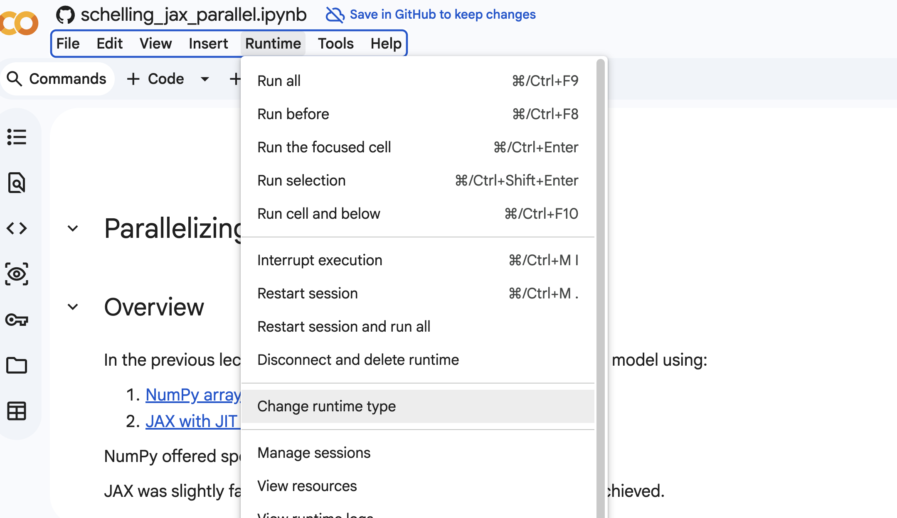
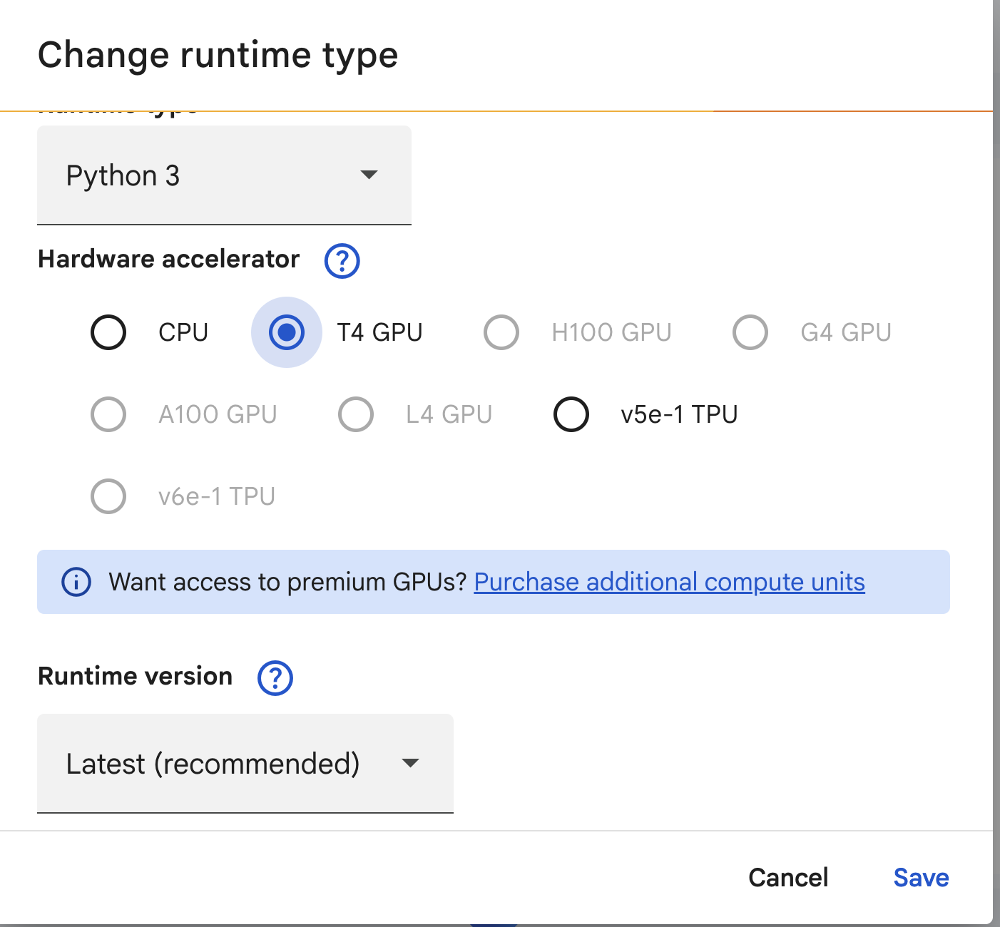

# Computational Methods for Simulation

## An Analysis of the Schelling Model

[](https://github.com/QuantEcon/scipy_tutorial_2026/actions/workflows/publish.yml)

**Prepared for SciPy 2026**

**Authors: [John Stachurski](https://johnstachurski.net/), [Thomas J. Sargent](http://www.tomsargent.com/), [Smit Lunagariya](https://smit-create.github.io/intro.html), [Matt McKay](https://github.com/mmcky)**

The tutorial demonstrates how to accelerate simulations using modern Python tools.

It focuses on Thomas Schelling's segregation model as our running example to explore acceleration tools like JAX.


## Overview

The Schelling segregation model shows how mild individual preferences can lead to extreme aggregate outcomes. We study:

1. **The basic model** — Understanding the dynamics of racial segregation using Python classes
2. **NumPy implementation** — Rewriting the model with arrays and functions for clarity and speed
3. **JAX implementation** — Translating the model to JAX syntax and concepts
4. **Further parallelization** — How can we exploit modern parallel hardware (e.g., GPUs)

## Running these lectures

### On Google Colab (no setup required)

QuantEcon workshop hosting website provides an option to directly run
these workshop lectures on Google Colab. If you choose to run the lectures
on Colab, you do not need any setup. All the dependencies are pre-installed
in the Colab. Use the following button on any of the lectures to open it in colab.



You can optionally run JAX lectures on a GPU or TPU to see the performance gains. You can connect to a GPU/TPU in colab in the following way:



Click on available runtime




### On a local machine

You will need Python 3.11+ installed on your local machine.

The following two options show how to setup the dependency if
you plan to run these lectures locally.

#### Option 1 (single command)

```
pip install --upgrade matplotlib numpy jax
```

#### Option 2 (If you have conda/mamba installed)

1. Clone the repository:
```
git clone https://github.com/QuantEcon/scipy_tutorial_2026.git
```

2. Create a new environment using the `environment.yml` from this repo.

```
# Run this from root directory of this repository
conda env create -f environment.yml
conda activate quantecon_scipy_tutorial_2026
```

#### Verification

```
# Run a small python script from the root of the repository
python setup_test.py
```

## License

This work is licensed under a [Creative Commons Attribution-ShareAlike 4.0 International License](http://creativecommons.org/licenses/by-sa/4.0/).
